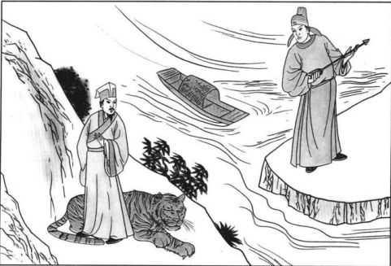

# 《源点：The Arche Point》

## 创世篇

世间由两部分构成，一是外驱力，这种力量看不见摸不着，但又是实实在在驱动着宇宙万物的运行；
二是实受体，这部分看得见摸得着，受外驱力的影响而运动，简单来讲就是物质。没错，世间就是由能量和物质构成，简言之就是一阴一阳。
世间万物虽千奇百怪，种类无穷，但又在某些层面拥有极高的相似性，一切的一切其实都是某种“规则”下诞生的复制品。

天、地、万物；父、母、子女；阴、阳、受精卵，等等，这些都是一一对应的关系。
此外，天体、星系、宇宙；细胞、组织、人体；人类、社会、国家，等等，也是一一对应的关系，这些虽然都是不同的事物，但却在某一层面上又是
非常的相似，好像天地万物都不约而同地遵循同一个规则来运行，好像都是同一个规则下所诞生的复制品。

believe it or not，宇宙之下的一切看起来充满了随机性、混沌性，但实则都是严格按照规则和秩序执行的机器罢了。
没错，我们都有着既定的轨迹和命运，我们都是被一个机器执行和运作着。想想这机器性和既定的命运轨迹，笔者不由地觉得，我们有可能是被困住了，
被困在了这个地方，被机器般地执行着命运，无法挣脱，且永远无法获得自由。Once you come here, you will never vanish.

其中最容易理解的便是生与死，细胞有生死，组织有生死，人体有生死；天体、星系、宇宙亦有生死，万物皆有生死。生死是一场无休无尽的轮回，
一旦你来到了这个世界，你就知道终有一天你会死去。而死呢？太极告诉我们，死亡只是去往另外一个世界罢了，你永远都不会消失，也无法消失，
你永远都无法获得真正的自由，只要你存在，你就会被这既定的规则无情地运作着，活得久了就会死去，死得久了就又会活过来。

不仅细胞、组织、人体是如此；人类、社会、国家是如此，宇宙中的万物，甚至宇宙本身也是如此。大家都在遵循这一个规则在运行，
某种层面而言，你和宇宙在本质上并没有什么不同，因为大家有着同样的运行规则。换言之，宇宙怎么运行，你就怎么运行；你怎么运行、宇宙也会怎么运行。

所以笔者一直以来有个观点，那就是：我即是宇宙，万物即是宇宙。你身上的细胞认为，你就是它们的宇宙，那细胞又会是谁的宇宙呢？
一切都看起来非常的相似，人类的子女终有一天会离开家庭，去创造自己的天地，那动物们不也是这样吗？非洲草原的马、狮子、大象，甚至就连细胞也会分裂出去。

万物好像都商量好了一般，都在遵循同一个规则运行着，虽然外表、形态各有千秋，但本质上大家都有着相同的轨迹和命运，生与死、家庭与分离......
更悲观地来说，万物都是同一个规则下的复制品，这再次印证了笔者的观点，我即是宇宙，万物即是宇宙。

如此，我们便会得知宇宙的一切秘密。比如，宇宙是如何诞生的？根据我即是宇宙的观点，我们可以得出宇宙的来历和你的来历是一样的，那便是阴阳结合形成一颗卵，
再从卵演变发展至今，整个过程从无到有，又终会从有到无，这句话与佛家哲学的观点不谋而合。再结合我国古代的创世神话，盘古从一颗蛋中出生，
然后开天辟地形成了现在的宇宙。

但我们只需要稍加思索一下，我们就会发现，不仅盘古是这样来的，万物不也是这样来的吗？ 鸡、蛇、人类，等等，万物都是从一颗卵中诞生而来，最后破壳来到世间。

所以，这就是阅读、理解神话的正确方式，其中一个最重要的思想便是类比思想，我即是宇宙，万物即是宇宙，上面的例子告诉我们，万物均始于一颗蛋。
于是，我们便回答了一个困扰世界已久的哲学问题，这个世界是先有鸡还是先有蛋？这听起来虽然是一个无尽的循环，但我们总能从中截取一个最小的周期，
那便是万物始于阴阳，阴阳结合形成卵，然后便有了万物。所以，对于这一问题，笔者的答案是先有蛋，不仅鸡是如此，万物皆是如此，我们的世界始于一颗蛋，
然后开天辟地，破壳而出。

## 包罗万象

上篇笔者提到一种思维模式——类比思维模式。万物皆是盘古，万物又开辟着属于自己的宇宙。当然，这种类比思想不仅在神话文化里有所呈现，
在我国古代，这种文化处处有所体现，这便是“象”文化。

古时，大禹曾铸九鼎来管理九州，在后续的历史中，各代君王也效法如此，慢慢地，鼎就变成了王权、权力的象征。
在三国末期，诸葛亮曾发现魏延的头部长有反骨，是反叛的象征。在诸葛亮逝后，魏延的一句狂言“谁敢杀吾？”在我国后世广为流传，几乎人人皆知，

所以，什么是“象”呢？笔者给出自己的理解，象是一种象征、现象、景象、相似（像）、图像。
举个例子，动物需要进食、人需要吃饭、汽车需要加油、手机需要充电，这些虽然是完全不同的东西，但都是相似的，它们有着共同的象征，
那就是A eat B，如此一来A摄入B就是一种象，而不用去管A是谁，B又是谁。

“象”集成了类比思维的精髓，接下来举一个《断易天机》中的例子，图为六十四卦中的离为火，这幅图就是在描述离为火的象，那么如何理解这副图呢？
笔者给出自己的理解，任何分离（因为是离卦）的两个事物，都是其中一方想干掉另外一方，而另外一方则如终日骑虎，每日提心吊胆。
图中一人拿箭，想要跟对岸的人摩拳擦掌，中间一条河流代表双方的分离、分歧与隔阂。

所以，有哪些是符合此象（离为火的象）的呢？中国与台湾，朝鲜与韩国，等等。
这就是类比思维模式的精髓所在，把世间万物简化到不能再简化，提炼凝聚为一种“象”，那么现在这个“象”就可以代入世间所有的情况。

## 易经八卦

《易经》是“象”的集大成者，易为简易（当然还有其他含义，后续会提到），它把宇宙万物简化到不能再简化，最后简化到仅仅用八个符号（八种象）
便可代表世间所有的事物，这便是本篇要讲到的易经八卦。

下面这两句话，想必是我们每个中国人最为熟悉不过的了。

道生一，一生二，二生三，三生万物。
太极生两仪，两仪生四象，四象生八卦。八卦生万物（笔者补充）

仔细理解就会发现，这上面两句话其实是一一对应的关系。“道”就是太极，“一”就是两仪，“二”就是四象，“三”就是八卦。
如何理解呢？其实就是简单的二进制，道生“一”，这个“一”就是一位二进制，一位二进制有0和1两种情况，就是阴和阳，就是两仪；
“二”就是两位二进制（在原先一层的基础上加了一层），两位二进制有四种情况，少阴、少阳、老阴和老阳，这便是四象；
“三”就是三位二进制（又加了一层），八卦就此诞生，乾、兑、离、震、巽、坎、艮、坤，这就是宇宙万物最基本的八种象了。

乾为纯阳，坤为纯阴，其他的六卦均由乾和坤结合而成，就像一个家庭里父母（乾坤）创造了子女（其他六卦）一般。
当然，宇宙中的万物都在运动，这让八个卦之间产生了关系，那一共有多少关系呢？排列组合就是八八六十四种关系，这便是六十四卦。
六十四卦揭示了八卦与八卦之间的关系，揭示了两个卦碰撞在一起会诞生出怎样的火花。

比如：家庭里父亲的关系凌驾于母亲之上，那就是天地否卦，这个父亲就是痞子嘛；
反之，若是父亲很尊重母亲，那就是地天泰卦，家庭永远幸福、平安、美满。

以下介绍八卦（八种基础象）

## 六十四卦

上篇我们讲到了易经八卦（世间的八种基本象），没想到这简简单单的八个符号就可以代表世间所有的事物，而这也正是易经可以用来占卜的原因。
因为它囊括了世间所有的东西，而占卜则是在这无穷的可能性中找到其中一种结果，那么为何我们使用六十四卦来进行占卜，而不是八卦呢？

因为占卜是对事件（Events）的预测，虽然八卦就可以代表万物，但是万物不交互，又怎会产生事件呢？就像上篇中我们讲到父母的关系，
只有事物（Things）之间产生了交互、发生了碰撞，才会诞生事件（Events）。

八卦只是事物（Things），单一的八卦没有交互、没有碰撞则无法产生事件（Events）。
于是我们就让八卦之间发生交互、发生碰撞，经排列组合后，共计八八六十四种情况，由此便诞生了六十四卦。

如此，万物（Things）之间拥有了交互，也就诞生了事件（Events），而现在这六十四个卦就代表着世间所有的事件（Events），
六十四卦中的每一个卦分别代表、象征着一种事件。

简言之，八卦是万物的象征，而六十四卦则是万事的象征（八卦=Things，六十四卦=Events）。

比如：动物会迁徙、人会出行，对应的就是旅卦；动物会群居、人会有组织（家庭、同事），对应的就是家人卦；人体会有免疫（微生物之间的战争），
人类也会打仗，万物皆有争斗，对应的就是师卦；......

## 不易、变易

天地万物都遵循同一个运行法则，这个法则是不会变的，此为不易。

这个世界里，万物都会从一种状态不可避免地变成另外一种状态，生与死，经济学中的涨与跌， 国家、企业、个人运势的昌盛与衰落，
休息与工作，爱与厌倦，家人到乖离，等等。

你会发现某些词汇总是能找到它的对立孪生词，在易经六十四卦里也能总找到成对的卦——对立孪生卦。
比如：乾为天-坤为地、山地剥-地雷复、山泽损-风雷益、火地晋-地火明夷等等。
这也是在说明事物总会从某种状态会进而演变到对立的状态，阴阳互转，此为变易。

比如：万物需要发展、人需要工作（火地晋），但工作得久了就需要休息睡觉了（地火明夷），而休息得久了，焦虑感就会自然产生，迫使你去工作。

试想一下，如果你可以活几千年，想象一下在这几千年的历程中你和爱人从坠入爱河，到失去感觉、再到相看两生厌，只要时间足够久，这几乎是一个必然的结果。
现在你应该会明白为什么西方神话中诸神的关系那么混乱了，因为他们活得实在是太久了，一辈子要嫁娶很多个人，虽然这在人类的视角里很乱，
但这就是自然之理，这就是变易。

乾卦上九有言：亢龙有悔。象曰：盈不可久也。什么意思呢？上九是乾卦的至高之位，阳气盛到了极点，当一样东西来到了顶点的时候，那么等待它的便是下坡。
泰卦九三有言：无平不陂，无往不复。象曰：此乃天地之际也。大致意思为，没有只有一马平川而没有坎坎坷坷的，没有只有去往而不会回来的。

这两句爻辞不禁让笔者想起了数学中的y = sin(x)函数，人生不会总是一帆风顺的，也不会总是事事不顺的，人生总有起起落落。
如果你在逆境中待久了，易经会告诉你，明天的太阳离你不远了。 笔者从小到大也见证了很多小时候学习成绩优异，而长大之后...
这大概就是“盈不可久也”的含义吧。同样的，国家、公司、企业也都遵循这个道理，从兴盛到衰落、从弱小到强大，在漫长的时间洪流中，这些都是注定的，
都会从一种状态演变到对立的状态，阴阳互转、阴极成阳、阳极成阴。

所以，如果你明白阴极成阳、阳极成阴，那么你便可以运用这个道理。
比如受凉导致的落枕，通常人们会用热敷法,但收效往往微乎其微，正确的做法是用冷水，阴极成阳。

当个人的事业到达鼎盛时期之时，就要预料到下坡路就在眼前了，此乃天道，自然之理，无法违抗。
和平久了自然就会有战争，战争久了又会归于和平（地水师-水地比），合久必分、分久必合（风火家人-火泽暌）。

虽然人们都热爱和平，共唱和平万岁的口号，高举和平的旗帜。但是笔者想说，战争（地水师）将会贯穿整个人类文明的始终，将会贯穿整个宇宙的始终。
你身上的免疫系统对抗异物。人类之间的竞争摩擦，包括物种之间的争斗，商业上的竞争，等等，又有哪一件不属于“战争”呢？

战争是宇宙中的一件基础事件象（地水师），只要宇宙存在，那么战争就会存在，残酷吗？但这就是自然法则，这就是宇宙的规则。

讲到现在，诸位应该对易经六十四卦有了更深刻的理解，就像之前讲到的，万物（Things）之间发生碰撞后诞生了事件（Events），
六十四卦就是八卦（万物）两两相互碰撞的产物，于是现在整个宇宙中会发生的所有事件（Events）就被包含其中了，
又因为它（六十四卦）包含了所有的事件，所以我们可以将它用于占卜.

言归正传，此前我们提到过一本书，叫做《神的九十亿个名字》，现在大家应该明白神究竟有多少个了吧？没错，神只有六十四个。
其中有两个主神，分别是掌管创造万物的乾、和掌握演化万物的坤，它们两个结合诞生了其余六十二个诸神。（阴阳结合化生万物）
这六十二个诸神里有掌管战争的战争之神阿瑞斯（地水师）......

读到这里，相比大家都知道如何阅读世界各国的神话了吧？其实都是象征，都是“象”，都是大家对宇宙本源的一种理解。

## 宇宙意志

你身上的细胞、微生物认为你就是它们的宇宙，而当我们把镜头聚焦到细胞上，我们会发现还有比细胞更加微小的存在，细胞核、线粒体、
还有各种为细胞工作的蛋白质，它们为什么都能动起来呢？为什么它们都在为同一个细胞工作呢？
细胞内的一切好像在被什么指挥着一样，一切都井然有序，浑然天成。

那些线粒体、蛋白质知道它们自己在被更宏大的东西（细胞）所支配吗？那些细胞知道它们自己在被人体意志所支配吗？
现在就产生了一个问题，意识是什么？它是如何产生的？是微小的意识聚合起来形成了宏观的意识？还是宏观的意识在操控支配微小的意识？

类比思想告诉我们，细胞拥有意识、组织拥有意识、人拥有意识、生态拥有意识、宇宙拥有意识，万物皆有意识。
要记住普天下的万物，就连宇宙本身都遵循同一个运行法则，万物都是一的复制品，万物归一，一即是全，全即是一。
看来笔者又和西方的哲学观点达到了某种程度上的统一。

不过意识貌似存在某种等级制度，比如人想吃冰的东西，虽然你的胃部会极力排斥这种行为，但最终它也只能选择默默承受。
对于胃部的细胞来说，我们就是它们的主宰，我们就是它们的“天”，我们就是那只无形的大手。
不过好在意识之间是可以沟通的，胃部会释放难受的信号，从而让我们减少食用冷饮的行为。

我想这也是为什么在我国古代会有大旱求雨的神降仪式，此外还有《祝由术》，祝由就是祝你好、祝你幸福，就是利用意识对人体各个部件进行沟通，
把它们哄开心了，身体自然就好了。

人体是喜欢平衡的，人体不就是一个庞大的微生物群落吗？当平衡被打破了，某些部位受损了，某些微生物数量不对时，
危害到了整个微生物群落的利益，免疫系统就会暴走，人体会发烧，微生物之间开始互相争斗，分裂正常的细胞用于修补，最后再归于平衡，人体恢复健康。

总之，人体会动用一切手段，来使其达成一种平衡，尽管有时不尽如人意（如：残疾、死亡），但这就是庞大微生物群落所能做到的最好的博弈结果了，
某种意义上讲，这就是宇宙之意，这就是天意。这也为什么在自然界有些物种会灭绝，灭绝以达致新的平衡，虽然很残酷，但这就是天道，这就是自然之理，
自然之理面前万物平等，此乃天地不仁，以万物为刍狗，即便是人类也是如此。

生物学中有个名词叫做物种入侵，像我国的清道夫鱼以及福寿螺，人们想尽办法驱赶、捕杀它们，使其不危害我们的生态系统。哈哈，与其称之为不危害我们的
生态系统，不如说是危害人类的生存环境，更决绝地来说，就是危害了人类的利益，所谓的保护环境，也指的是人类想要存活的环境。

言归正传，人类驱赶捕杀这些物种，像极了我们身上的免疫细胞与外来入侵者之间的战斗，“人体会动用一切手段，来使其达成一种平衡”，那么地球、自然
、生态就不会吗？人类数量太多时，用来杀人的病毒就会成为它们的抗体；当有别的物种入侵时，又会利用人类展开对它们的捕杀。但这个过程中，
人类是无法察觉的，人类不会觉得自己是被利用的、操控的，人类只会感到这些外来物种威胁到了自身的利益，才会去捕杀它们。

我们主宰着身上的部件、细胞，那又是谁在主宰着我们呢？这就是比我们的意志更高的存在，比我们更为宏大的存在，
我们感受不到，但它又时时刻刻在影响着、操纵着我们，这就是宇宙意志(something greater) 或者叫做整体意识。

人体喜欢平衡，那么宇宙也喜欢平衡。本质而言，是因为平衡这种状态符合绝大组成部分，甚至是所有组成部分的利益，是所有组成部分博弈的最佳结果。
简言之，这符合所有人的利益，这符合所有微生物的利益。当一个物种过多时，平衡被打破时，宇宙会用一切方法来调控它们的数量，
病毒、战争、甚至它们自己就可以调控自己，权力、政治、阶级，资源的掌控，等等。

现在的年轻人为什么喜欢不婚不育？笼统的说法是大环境不好，但实则我们早已被宇宙意志(something greater)所影响，
大环境变差只是宇宙意志的一种调控方式，令人察觉不到的是，它会实打实地去影响你的心智、念头、情绪和一切，因为我们是更加宏大的事物的一部分，
它会动用一切手段来使其达到新的平衡，达到符合所有部分的利益为止。

笔者见过一种神奇的生物，这种生物可以雌雄互转，当种群数量较低时，它们就会像商量好了一般，该变成什么性别就变成什么性别，孕育新的后代。
我想它们大概是收到了宇宙意志的感召，但是笔者估计它们自己应该是察觉不到自己被操控的，它们估计只是感觉到自己的性欲变强了。

至此，笔者有个小预言，当人类的科技、医疗发展到可以治疗一切疾病，即实现人类永生的时候，人类会失去生育能力。
这个预言和某些关于外星人的都市传说也是不谋而合，没有什么是无敌的，宇宙总有一种方法来对付你，对于人来说病毒是邪恶的，
但对于地球来说病毒正是它的抗体，若有越界，数以亿计的病毒早已为我们准备好。

若一个物种灭绝，那也是宇宙的意志，是自然万物博弈后的结果，灭绝之后还会达到新的平衡。我想，人类设立保护动物去保护濒危物种，可能就是
宇宙意志还不想让它们灭绝吧，毕竟这是宇宙想要挽留它们啊。但人类是感受不到宇宙意志的，人类只是认为自己应该帮帮它们，而实际上是在帮自己，
人类不想让自己赖以生存的家园一步步走向毁灭。

## 以太、指挥家

上篇我们提到了万物皆有意识，此外还有比意识更高的宇宙意志，它是一种我们感受不到，但又在时时刻刻操控影响我们的意识。
比如：细胞的意识在操控线粒体、蛋白质的意识；生态的意识在操控人类的意识，让我们捕杀一些物种以及保护一些物种；等等。

那么下面探讨一下生与死的哲学，人死了是指人体内的细胞都死掉了，所以才死掉的吗？
答案显然是否定的，人死了是掌控人体全局、对各个部位调控的能力走了，是指挥它们的宇宙意志走掉了。

就像在一场乐团的演奏中，指挥家走了，其后演奏小提琴、钢琴的人，他们的节奏全乱了，最后演奏也就停止了。
人体也是如此，当人死后，人体内的各个部件开始失序、紊乱、失控，最后体内的细胞才会全部消逝殆尽。

世界末日也是一样的，是宇宙先死？还是宇宙里面的星体、生命先死？答案显而易见，是宇宙先死，然后宇宙内的星体由于失去了指挥，
开始紊乱，互相碰撞，最后全部湮灭。

所以，意识到底是什么呢？笔者给出自己的答案，意识就是笔者在【创世篇】中开篇提到的外驱力，它在指挥、引导实受体，从而让其运动。
不过，笔者愿意赋予它一个更具科学、哲学色彩的名字 —— 以太。 以太指挥着宇宙万物的运作，它是万物的指挥家，它就是阳，没了阳气的物体就是死物，
没了阳气的人就是过世的人，没有了以太的宇宙，就是天体失去指挥的宇宙，即将发生相互碰撞灰飞烟灭的宇宙。

传统医学的人会通过观气来判断一个人是否已经往生。占卜学中，我们占一个人是否还活着，若是得到【坤为地】，
纯阴之卦，毫无阳气，结果可想而知。

## 宇宙的发展方向

万物的本质是阴与阳，生命的本质是阴与阳结合的产物，结合则诞生生命，分离则各有各的归宿。生命的存在和延续，是以吸食其他的生命为代价的。
某种层面而言，生命是一个自私的东西，总是以最小的代价以换取最大的收益。也正是这种自私，才会形成现在的生态系统，人类从远古形态形成了现在的人类社会。
在此，笔者要给自私赋予一个更为宏大的定义，即，自我的满足。比如，人会喂养其他的生物，并将其称之为行善，虽然这种行为不大符合自私的定义，但行善之后
令人愉悦的欣慰感不也是一种自我满足吗？当然，英雄牺牲自我，这种伟大的自我实现感，不也是一种自我满足吗?

这不是狭义上的自私，这是更为广义的、高级的自私。所以，笔者认为，不仅仅基因是自私的（出自道金斯《自私的基因》）
，生命的本质就是自私的，甚至万物都是自私的。

这种自私，也为人类社会的发展明示出方向，从人力到机械，从机械到电力、计算机、AI，人类对效率的追求从未停止过，人类在想尽一切办法降本提效，
现在的公司不也是在这样做吗？好像万事万物都在往效率更高的方向发展，而违反这一定律的通通会被丢进历史的垃圾堆。

不仅人类社会如此，万事万物都在往效率更高的方向去发展，生物的进化，树根的生长，还有细菌的鞭毛，细菌是靠鞭毛的旋转来进行移动的，
它甚至进化出来了像轴承一般的结构，据说它的能量损失特别小，运作效率非常高。诸如此类，还有的昆虫进化出来了齿轮结构，用于实现腿部的同步跳跃。

至此，笔者不禁感叹宇宙的神奇，万物竟会如此内卷，不知为何，但一切都在朝着效率更高的方向发展... 也许这样做对“自己”有益吧，万物都是这般的自私。

## 科技和AI

现今有不少崇尚科学，甚至迷信科学的人认为有一天可以实现意识上传得以永生，但是它们连意识是什么都不清楚，它们简单地以为利用神经网络复刻出一个人
的模型就会实现永生，这种想法荒谬至极。更有人认为人工智能、大模型会诞生智慧，具备理解和情感能力。但笔者想说，AI是死的，它只是用了简单的数学原理，
搭建了很多神经元，并让它们之间产生联系形成神经网络，你可以无限制地训练它，让它达到你想要的结果，但最终它也只是会模仿，你教它，它才会模仿，
模仿出人类的对话、模仿出人类的情感。但生命的智慧是先天具备的，生下来就知道趋利避害，生下来就知道什么能吃什么不能吃，这是直觉，直觉不需要教的，
而机器正缺乏这种直觉，这也是AI最致命的缺陷。

一句话，Dead is dead，死的东西就是死的，不可能诞生智慧，它能做的只有学习和模仿罢了，至于AI危害世界更是无稽之谈了，AI不过只是个会模仿的机器。

## 法则的运用

对于一名真正的哲学家来说，不仅要了解万物的本源，万物的运行法则，还要学会如何去运用这些法则来达到自己的目的。
前面的并不难，最难的是这最后一步，我们该如何去运用它？相必只有最顶级的哲学家才能做到吧。《神的九十亿个名字》种提到，如果你掌握了神的名字，
那么神将会成为你的奴隶，它会为你办一切事情。此处的“神”不就是宇宙的运行法则吗？不就是“道”吗？掌握了它，就可以运用它，就可以在宇宙中肆意遨游
没有限制。

如果一家公司常年亏损，那么从某种角度而言，它符合【山泽损】的卦象，此时只需要把它翻转过来就能实现增益，转亏为盈。原理是【山泽损】调转过来就是【风雷益】。
如果一家律所经营惨淡，那么可以把它改造成【天水讼】的象，从而令其诉讼不断，改善它的营生。
同理，如果一个人想减肥，那么可以根据【山泽损】来达到减肥、减重的效果，具体的做法是六天为一个健身周期，前两天运动，然后休息三天，最后再运动一天。（阳阳阴阴阴阳 - 山泽损）
如果想要桃花，那么就把外表装饰得华丽一点，内心呢顺从一点，能听得进女生的话。（天风姤）

## 宇宙气象

宇宙是一个混沌系统，就像地球的气象一样，有风吹、有水流，云在不同的位置就会被吹往不同的地方，海洋里的鱼在不同的位置就会被洋流送往不同的地方。
那么对于人来说，我们该如何去往自己想要去的地方呢？（达到自己的目的呢）

笔者的答案是，要学会乘风，乘上正确的风，就能抵达正确的地方，这便是笔者对《风水学》的理解，学会乘风借势，你就会很轻松。
此处想到一句诗词：时来天地皆同力，运去英雄不自由。风水是什么？风水就是宇宙意志的流动，风吹以及水流，而我们每个人都是其中的小船，
逆流而上则会非常艰难，顺着它走只需扬帆。

以前的道士会看风水，会请神送鬼。很遗憾笔者没有这种超能力，但是想要下雨，打一剂增雨弹不就行了吗？天气热了，多打开窗通风不就行了吗？
没错，地球上的任何地方都有风水，不会看风水也可以直接改造风水。

对于一家公司来说，老大的位置为内卦，公司门面的方位为外卦，改造成【风雷益】的样子，那么宇宙意志就会涌进来帮你实现增益。
还是那句话，天热了打开窗就行，这是天地宇宙的法则在帮你。

## 象出则事发

笔者在包罗万象篇中提到，象是一种象征、现象、景象、相似（像）、图像。象可以用来占卜，比如六十四卦所对应的六十四种事件（Events）象，
那么象和现实还有哪些关联呢？

韩国的国旗是四卦，我们是八卦，它只有四卦，少了一半，所以它少了一半嘛（本是一体的，现在却成了半岛）

民进党党旗是台湾的俯视图，看起来像一片叶子，又像一艘船，所以如果继续让民进党执政，台湾会变成一叶孤舟，而最后的结果呢？叶落是要归根的。

MH370这个序列号反而成为了自己的结局，初登于天，后入于地，现在在一个见不到阳光的地方。

筷子掉在地上，筷落地，预示着事情将要落地，但若对应考试的话那就要落第了。

百 = 五日，因为上面的十少了一半。

根据这些事例，我们又从中衍生出了姓名学，比如取什么名字更好啊，更吉利啊，因为万物皆有象，象是什么样的，事物就会怎样去发展。
像飞机，那就会腾飞，比如我们有叫鹏飞的，还有国荣等等，这些名字取的都是一个寓意嘛。不过，现实中往往没有这么简单，比如诸葛亮，
字孔明，我这个亮是小孔里发出的光明；比如韩愈，愈为超越之意，于是他字退之。根据这些案例，笔者认为取名采取折中的方案比较好，阴阳平衡之理。
所以如果你的名字太过，不妨也给自己取个字来中和一下。

由此，我们加深了对象的理解，象是天机的一种呈现，什么看面相、手相都是一样的，都是通过外在的形象、象征来窥探其中的天机。
那么如何改变事情的结果呢？改象就可以，比如整容，原先一个不受欢迎的人，因为现在受到了很多人的追捧，这是最简单的例子。
如果你想挽救那一飞机的人，那就可以把那架飞机的序列号改了。要是想害一个人，同理。总之，我们利用象，可以达到神不知鬼不觉的效果。

如果一个家庭里，父亲经常在外出差，回家也只是住两天就走，那么很有可能这个家里乾的位置是客厅，因为这个父亲很像家里的一位客人。
此时只需要把客厅改成卧室即可，剩下的就交给时间了。
